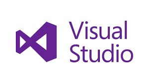
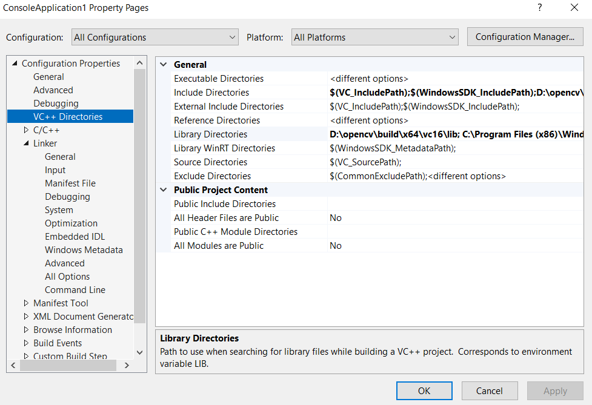
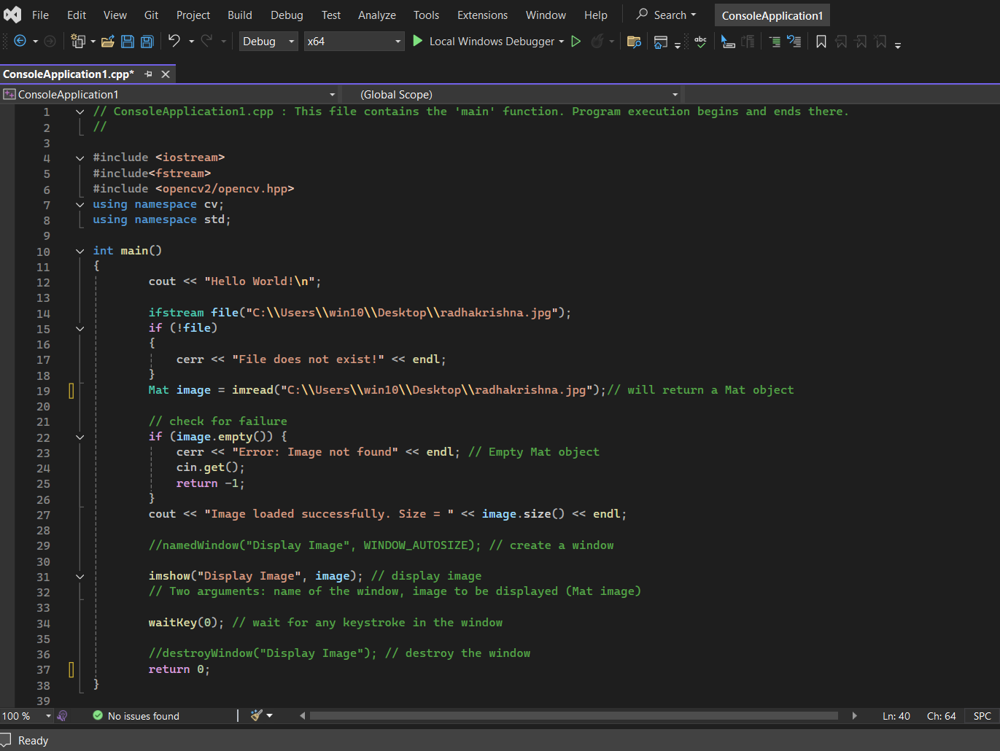
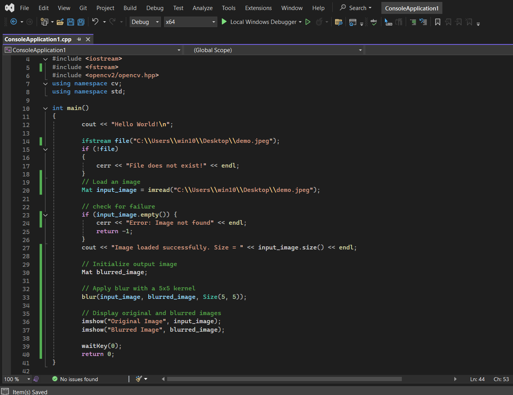
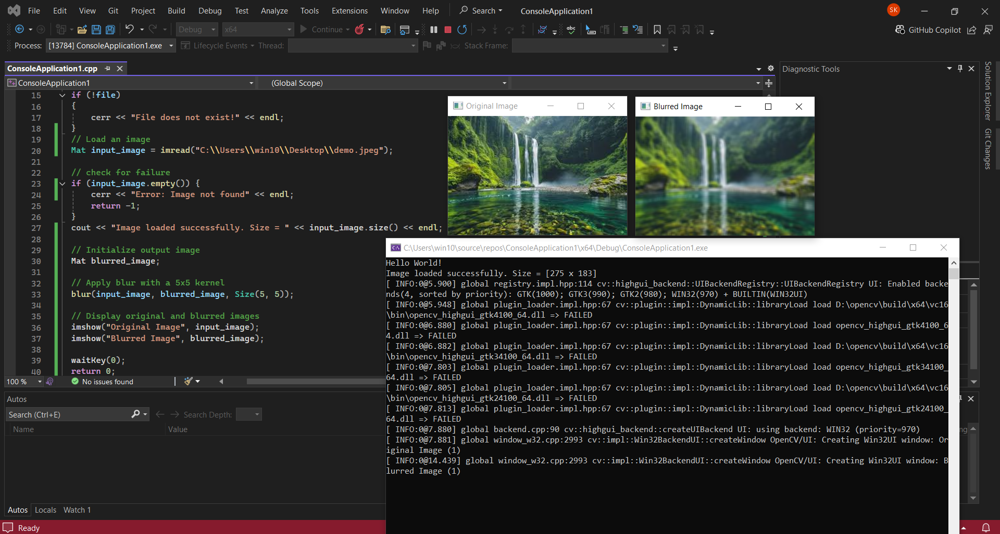
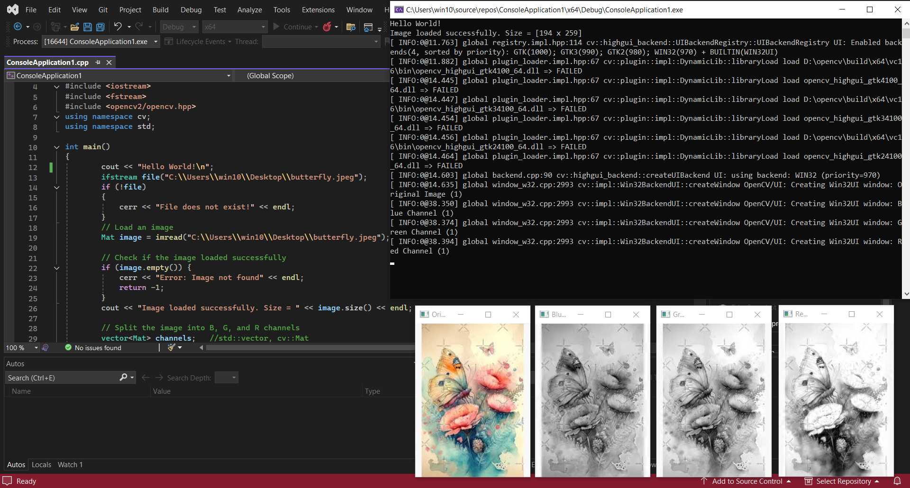

###**From Download to Detection:**

###**A Beginner\'s Guide to Installing OpenCV with C++**

*\"Welcome to computer vision, where lines of code interpret the visual
world. OpenCV with C++ is your essential toolkit for image processing,
real-time object tracking, or creative artificial intelligence
applications.\"*

##**[Introduction]{.underline}:-**

#**What is OpenCV?**

OpenCV (Open Source Computer Vision Library) is a powerful library
designed for computer vision, machine learning, and image processing. It
empowers developers to process images and videos, enabling capabilities
like object detection, face recognition, and handwriting recognition.
With its rich set of features and robust community support, OpenCV is an
essential toolkit for anyone venturing into the exciting field of visual
computing.

##***\"From installation to innovation, C++ and OpenCV fit lenses to your
###code,***
###***taking you beyond sight into the world of limitless vision.\"***

If you\'ve ever felt like setting up OpenCV is more of a riddle than a
routine---you\'re not alone!

In this guide, we\'ll walk through installing and setting up OpenCV with
C++ in Visual Studio (on Windows OS), laying a strong foundation for
transforming your ideas into projects that recognize, analyze, and
respond to visual data. So, let's embark on this journey and equip your
code with the power to perceive!

**[Target Readers]{.underline}:-**

This guide is tailored for a diverse audience eager to explore computer
vision and image processing with OpenCV in C++:

1.  ***Beginners in Computer Vision*** -- those new to OpenCV and
    looking to learn installation and basic usage.

2.  ***C++ Programmers*** -- developers expanding into image processing
    and computer vision.

3.  ***Students and Hobbyists in Tech*** -- especially in computer
    science or engineering, who want hands-on experience in computer
    vision.

4.  ***Visual Computing Enthusiasts*** -- anyone interested in real-time
    image processing, object tracking, or creative tech projects with
    visual data.

5.  ***Early-stage AI Developers*** -- those starting in AI and ML who
    want to explore tools used in facial recognition, object detection,
    and robotics.

By the end, you\'ll have a solid foundation in OpenCV setup and be ready
to bring your ideas to life in visual computing!

**[Pre-requisites]{.underline}:-**

Before diving into this guide, it\'s beneficial to have the following
prerequisites:

1.  **Basic Knowledge of C++:** Familiarity with C++ programming
    concepts, including variables, loops, and functions, will help you
    understand the code examples provided.

2.  **Familiarity with Integrated Development Environments (IDEs): A**
    basic understanding of how to navigate an IDE, such as Visual
    Studio, will be beneficial as you set up and write your code.

3.  **Windows Operating System:** This guide focuses on setting up
    OpenCV on a Windows environment, so having access to a Windows
    machine is essential.

4.  **Installation Rights:** Ensure you have the necessary permissions
    to install software on your computer.

5.  **Curiosity for Computer Vision:** A genuine interest in visual
    computing will enhance your learning experience.

{width="2.175in"
height="1.1303149606299212in"}With these prerequisites in mind, you're
ready to start your journey into the world of OpenCV and computer
vision!

**Install Visual Studio (latest version)**

**1.** **Download Visual Studio:**

\- If you haven't already, download and install Visual Studio (Community
Edition is free): <https://visualstudio.microsoft.com/>

This will be downloaded as **Visual Studio Setup** in your 'downloads'
folder.

**NOTE: This is Visual Studio IDE, not Visual Studio Code.**

**2.** **Select the Desktop Development with C++ workload:**

\- During installation, make sure to include the **\"Desktop development
with C++\"** workload.

**[Potential Challenges and Solutions]{.underline}:-**

In this section, we\'ll address some common challenges you might
encounter while installing OpenCV and working with C++. Here are a few
potential problems along with their solutions:

1.  **Installation Issues:**

**Problem:** Errors during Visual Studio installation.

**Solution:** Ensure you have a stable internet connection. Check for
any system updates and restart your computer before attempting
installation again.

2.  **OpenCV Download Problems:**

**Problem:** Unable to download the OpenCV ZIP file.

> **Solution:** Verify your internet connection. If the download link is
> broken, try accessing it from a different browser or check the
> official OpenCV GitHub page. Always prefer the official website of any
> software to download/install.

3.  **Environment Variables Not Set:**

> **Problem:** OpenCV not recognized in Visual Studio.
>
> **Solution:** Double-check that you\'ve set the environment variables
> correctly. Ensure there are no typos in the paths and that they point
> to the right directories.

4.  **Compilation Errors:**

> **Problem:** Getting compilation errors when running OpenCV code.
>
> **Solution:** Ensure you've included the correct headers and linked
> the necessary libraries. Review the code for any syntax errors or
> missing components.

5.  **Runtime Errors:**

> **Problem:** Application crashes or does not run as expected.
>
> **Solution:** Check for issues such as incorrect paths to images or
> videos. Use debugging tools in Visual Studio to identify where the
> error occurs.

6.  **Lack of Resources:**

> **Problem:** Your computer is running slowly during OpenCV processes.
>
> **Solution:** Close unnecessary applications running in the background
> and ensure your system meets the minimum requirements for running
> OpenCV effectively.

7.  **Learning Curve:**

> **Problem:** Difficulty understanding OpenCV functions and concepts.
>
> **Solution:** Utilize online resources such as tutorials, forums, and
> the official OpenCV documentation. Engage with community forums for
> help and guidance.

By being aware of these potential challenges and their solutions, you
can navigate the installation and initial use of OpenCV with greater
confidence. Remember that troubleshooting is a part of the learning
process, so don\'t hesitate to reach out to the community or refer to
additional resources if you encounter any issues!

**[Step-by-Step Installation Guide]{.underline}:-**

Here\'s a step-by-step guide on how to install OpenCV and set it up in
Visual Studio:

[**Step 1:** **Download OpenCV**]{.underline}

**1.** **Visit the OpenCV Website:**

\- Go to the OpenCV releases page: <https://opencv.org/releases/>

**2. Download the Latest Version** (4.10.0 released on 03.06.2024):

\- Choose the appropriate version for your system (usually the Windows
version) and download the ZIP file.

**3.** **Extract the ZIP File:**

\- Extract the downloaded ZIP file to a location on your computer (e.g.,
**\`D:\\opencv\`**).

**[Step 2: Set Up Environment Variables]{.underline}**

**1.** **Open System Properties:**

\- Right-click on \"This PC\" or \"Computer\" on your desktop or in File
Explorer and select **\"Properties\".**

\- Click on **\"Advanced system settings\"** on the left.

\- In the System Properties window, click on the **\"Environment
Variables\"** button.

**2.** **Add OpenCV to System PATH:**

-In the Environment Variables window, under **\"System variables\",**
find the variable named **\`Path\`** and select it, then click
**\"Edit.\"**

\- Click **\"New\"** and add the path to the **OpenCV \`bin\`
directory**.

For example: **D:\\opencv\\build\\x64\\vc16\\bin** (make sure the path
matches your installation).

**1 2 3**

{width="7.861111111111111in"
height="3.338888888888889in"}

***Fig. Illustration of adding path to opencv bin in the Environment
Variables.***

**[Step 3: Create a New Project in Visual Studio]{.underline}**

**1.** **Open Visual Studio:**

\- Launch Visual Studio and select **\"Create a new project.\"**

**2.** **Choose a Project Template:**

\- Select **\"Console App\" (C++)** and click \"Next.\"

**3.** **Configure Your Project:**

\- Enter a **project name and location**, then click **\"Create\".**

**[Step 4: Configure Project Properties]{.underline}**

**1.** **Open Project Properties:**

\- Right-click on your project in the **Solution Explorer** (under
'View' tab) and select **\"Properties\"**.

***NOTE: We'll be setting up the properties under 'All Configurations'
and 'All Platforms, ' which you can select from the respective drop-down
menus of configuration and platform at the top.***

**2.** **C/C++ Directories:**

\- Under **\"Configuration Properties\"**, go to **\`C/C++\` \>
\`General\`.**

\- In the **\"Additional Include Directories\"**, add the path to the
**OpenCV \`include\` directory**.

For example: **\`D:\\opencv\\build\\include\`**.

-   Also, add the path to the **OpenCV \`lib\` directory:
    \`D:\\opencv\\build\\x64\\vc16\\lib\`**

*To successfully compile your OpenCV projects, ensure you add the OpenCV
library path to your project settings; this step allows the compiler to
locate the necessary libraries, enabling access to powerful image
processing.*

-   To access essential user-mode libraries for developing Windows
    applications, add the following path to your project settings:
    **C:\\Program Files (x86)\\Windows
    Kits\\10\\Lib\\10.0.22621.0\\um\\x64;** this will enable you to link
    against the necessary Windows API functions.

{width="7.5in"
height="5.189583333333333in"}

**TIP: After you add the directory path in the designated column, first
click apply and then OK. I would prefer adding all the directories you
know, will be required, and then click Apply \> OK.**

**It may happen so that all the libraries that will be required in a
particular project are not known at the beginning itself. In that case,
while 'building' the project, you can come to know about the library
from the error 'cannot open xyz.lib' (means xyz library has not been
linked).**

**3.** **Linker Settings:**

Go to **\`Linker\` \> \`General\`**, add the following library paths
**in \"Additional Library Directories\" field** to ensure that our
project can compile and link successfully to the libraries we need to
use.

1.  **OpenCV Libraries: \`D:\\opencv\\build\\x64\\vc16\\lib\`**- This
    path contains the OpenCV libraries necessary for utilizing image
    processing and computer vision functions in your application.

2.  **Visual Studio Libraries**: **D:\\Visual Studio 2022
    IDE\\VC\\Tools\\MSVC\\14.41.34120\\lib\\x64** - This directory holds
    essential libraries provided by Visual Studio that support standard
    C++ functionalities.

3.  **Windows SDK User Mode Libraries**:

**C:\\Program Files (x86)\\Windows
Kits\\10\\Lib\\10.0.22621.0\\um\\x64** - This path includes user-mode
libraries for Windows applications, enabling access to crucial Windows
API functions.

4.  **Windows SDK Universal C Runtime Libraries**:

**C:\\Program Files (x86)\\Windows
Kits\\10\\Lib\\10.0.22621.0\\ucrt\\x64** - This directory provides the
Universal C Runtime libraries required for standard C/C++ operations.

{width="7.32382217847769in"
height="5.041909448818898in"}

*Adding these paths will allow your compiler to locate the necessary
libraries, enabling you to leverage the full capabilities of OpenCV and
the Windows API in your C++ projects*.

**[Libraries that will be used:]{.underline}**

1.  **OpenCV Libraries:** opencv_world4100d.lib (Debug version) ,
    opencv_world4100.lib (Release version) and some other
    module-specific libraries as needed (e.g., opencv_core4100d.lib,
    opencv_imgproc4100d.lib, etc.) for which we will include the header

***#include \<opencv2/opencv.hpp\>***

***using namespace cv;***

2.  **Visual Studio Libraries**: Standard libraries such as libcmt.lib,
    msvcrt.lib, etc.

3.  **Windows SDK User Mode Libraries**: Common user-mode libraries like
    kernel32.lib, user32.lib, etc.

4.  **Windows SDK Universal C Runtime Libraries**: Libraries like
    ucrtd.lib, libucrt.lib.

We need to specifically mention the libraries that we have to use in our
project, in the project properties as explained in point 4.

**4.** **Input Libraries:**

\- Under **\`Linker\` \> \`Input\`**, add all the **required libraries
in the \"Additional Dependencies\" field**.

-   The libraries you need will depend on the version you installed, but
    commonly you'll include:

**opencv_world\<version\>.lib** **\-\-\-\-\-\-\-- Syntax**

**Replace \`\<version\>\` with the version number you downloaded**
(e.g., **\`opencv_world4100.lib\`**).

***TIPS:***

1.  *If the opencv version installed is, say 4.10.0, as mentioned then
    \<version\> in the above syntax will be replaced by 4100.*

2.  *Do not include both the debug and release version libraries
    together, in my case, it produced an error. You can just add debug
    mode library \`**opencv_world4100d.lib\`.***

-   Now add other libraries: **msvcrt.lib; kernel32.lib; ucrtd.lib**

*(Libraries must be separated with a semicolon).*
{width="7.030302930883639in"
height="5.150553368328959in"}

**One Last Step:**

Add the above-mentioned "include" and "lib" in the respective fields
under **VC++ Directories** also.

{width="7.295454943132109in"
height="5.135416666666667in"}

**[Verifying your Installation]{.underline}:-**

**[Write Your First OpenCV Program]{.underline}**

Here's a simple program to test your installation: ***Reading and
displaying an image***

#include\<iostream\>

#include \<opencv2/opencv.hpp\>

using namespace cv;

using namespace std;

int main() {

Mat image = imread(\"path_to_your_image.jpg\"); // Replace with your
image path

if (image.empty()) {

cout \<\< \"Could not open or find the image!\" \<\< endl;

return -1;

}

imshow(\"Display Image\", image);

waitKey(0);

return 0;

}

***Our First OpenCV program in C++***

{width="7.766666666666667in"
height="5.634722222222222in"}

**Note: This is a sample program only. Here I am trying to display an
image of Radha Krishna, that I have in my system, for demo.**

**[Build and Run Your Project]{.underline}**

1\. **Build the Project:**

\- Go to the \"Build\" menu and select \"Build Solution\" (or press
\`Ctrl + Shift + B\`).

2\. **Run the Program:**

\- If there are no errors, run your program by clicking the \"Start\"
button or pressing \`F5\`.

The program should display the specified image in a pop-up window.

***Output:***

{width="7.833333333333333in"
height="4.133333333333334in"}

***We successfully executed our first OpenCV C++ program with the
blessings of God.***

**Troubleshooting Tips:**

-   If you encounter any errors related to missing DLLs when running
    your program, ensure the path to the OpenCV \`bin\` directory is
    correctly set in the environment variables.

-   Make sure you are using the correct version of OpenCV libraries that
    match your project\'s architecture (x64 or x86) and the version of
    Visual Studio you\'re using.

By following these steps, you should be able to successfully install
OpenCV and set it up in Visual Studio for your projects. Happy coding!

**[Experimenting with More OpenCV Functions]{.underline}:-**

***Image Blurring with OpenCV***

***Program:***

{width="7.789141513560805in"
height="5.346773840769904in"}

***Output:***
{width="7.870833333333334in"
height="4.508064304461942in"}

***Color Channel Magic: Extracting and Visualizing RGB Channels with
OpenCV***

*OpenCV library functions usually read images in BGR format which means
the blue plane first, the green color plane next and the red plane at
the end. Color channel extraction refers to separating an image into its
individual color components (usually, red, green & blue in RGB images).*

*The extracted channels are grayscale images where the intensity
corresponds to the strength of the respective color.*

***Program:***

{width="7.758064304461942in"
height="5.805555555555555in"}

***Output:***

{width="7.814516622922135in"
height="4.483023840769904in"}

**[Conclusion]{.underline}:-**

With OpenCV now set up in Visual Studio, your C++ projects are equipped
for powerful computer vision tasks. From image analysis to real-time
applications, OpenCV opens doors to endless possibilities. With this
foundation, explore basic functions or dive into advanced topics like
image processing and object detection---your vision-ready code is set to
unlock the digital world.

{width="1.1875in"
height="2.04375in"}**About the Author**

***Smarth Kaushal**\
**Sophomore, BE-CSE***\
Thapar University\
Computer Science and Engineering Department\
Patiala, Punjab, India\
Email ID: <skaushal1_be23@thapar.edu>

LinkedIn: <http://www.linkedin.com/in/smarth-kaushal-02a1092b2>

GitHub: <https://github.com/Smarth2005>

GitHub ID: 175465457

**Interests:** Computer vision, image processing, C++ programming,
algorithm optimization, artificial intelligence, and software
development.

**Acknowledgement**

I would like to thank ***Dr. Suresh Raikwar***, Professor from the
Computer Science and Engineering Department at Thapar University for his
invaluable guidance and encouragement, inspiring me to explore OpenCV
and write this blog. This support has been instrumental in developing my
interest in computer vision and programming.
 
